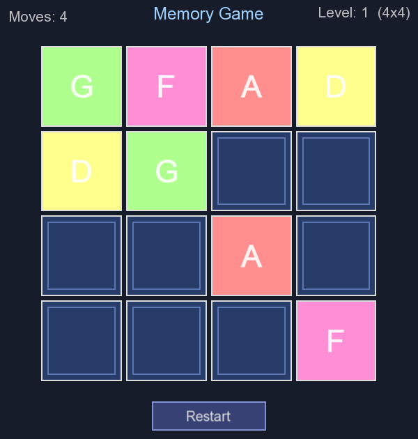

# MemoryGame

A memory matching game built with modern C++ and SFML. Features a modular engine architecture, comprehensive automated testing, and an extensible end-to-end testing framework.



## ✨ Features

- **Progressive Difficulty**: Start with 4x4 board, advance to 6x6 and 8x8 levels
- **Smooth Animations**: Flip animations with color-coded card pairs  
- **Modular Architecture**: Reusable Engine and E2E testing framework
- **Cross-Platform**: Runs on macOS, Linux, and Windows
- **Comprehensive Testing**: Unit tests + headless/headed end-to-end tests
- **Extensible Design**: Easy to add new game modes, AI players, or UI themes

## Table of Contents

1. [Quick Start](#quick-start)
2. [Requirements](#requirements)
3. [Project Structure](#project-structure)
4. [Building & Running](#building--running)
5. [Gameplay Rules](#gameplay-rules)
6. [Architecture](#architecture)
   - [Engine Overview](#engine-overview)
   - [Card & Animation System](#card-rendering-and-animation)
   - [Game Model](#runtime-state-model)
   - [Scene & UI](#scene-input-and-ui)
7. [Testing](#testing)
8. [Configuration & Tuning](#configuration--tuning)
9. [Extending the Game](#extending-the-game)


## Quick Start

### Prerequisites
- C++17 compiler
- CMake 3.16 or higher
- SFML 2.5+ (auto-fetched if not found)
- GoogleTest (auto-fetched for tests)

### Build & Run

```bash
# Clone and configure
cd MemoryGame

# Build with tests enabled
cmake -S . -B Build -DMEMORYGAME_BUILD_TESTS=ON
cmake --build Build

# Run the game
./Build/bin/MemoryGame

# Run unit tests
ctest --test-dir Build

# Run E2E tests
./Build/bin/memorygame_e2e
```

## Requirements

- **C++17** compiler support
- **CMake** 3.16+
- **SFML** 2.5+ (automatically fetched)
- **GoogleTest** (automatically fetched for tests)
- **macOS**: Helvetica or Arial font (for UI text)

## Project Structure

```
MemoryGame/
├── MemoryGame/              # Game logic and UI
│   ├── Include/             # Card.h, GameModel.h, GameScene.h
│   └── Source/              # Implementations + main.cpp
├── Engine/                  # Reusable runtime library
│   ├── Include/             # Game.h, Scene.h, DelayedAction.h
│   └── Source/              # Engine implementation
├── E2EFramework/            # App-agnostic E2E testing framework
│   ├── Include/             # Driver.h, Interaction.h, Conditions.h
│   └── src/                 # Framework implementation
├── Tests/                   # Game-specific tests
│   ├── e2e_main.cpp         # E2E test entry point
│   ├── e2e_smoke_test.cpp   # Quick smoke tests
│   ├── e2e_regression_test.cpp  # Comprehensive tests
│   ├── PageObjects/         # Test page objects
│   ├── Drivers/             # Game-specific drivers
│   └── Tools/               # Test utilities (GIF generation, etc.)
├── CMakeLists.txt           # Root build config
└── README.md                # This file
```

**Module Responsibilities:**

| Module | Purpose | Key Components |
|--------|---------|-----------------|
| **MemoryGame** | Game logic and UI | Card, GameModel, GameScene |
| **Engine** | Reusable runtime | Game loop, window management, Scene interface |
| **E2EFramework** | Testing framework | Driver orchestration, Interaction patterns, Conditions |
| **Tests** | Automated testing | Unit tests, E2E tests, Test drivers |

---

## Building & Running

### Basic Build

```bash
cmake -S . -B Build
cmake --build Build --target MemoryGame
./Build/bin/MemoryGame
```

### Build Options

| Option | Description | Example |
|--------|-------------|---------|
| `DMEMORYGAME_BUILD_TESTS` | Include unit tests | `-DMEMORYGAME_BUILD_TESTS=ON` |
| `DMEMORYGAME_HEADED_E2E` | Run E2E tests with display | `-DMEMORYGAME_HEADED_E2E=ON` |
| `DCMAKE_BUILD_TYPE` | Build configuration | `-DCMAKE_BUILD_TYPE=Release` |

### Build Targets

```bash
# Build everything
cmake --build Build

# Build only the game
cmake --build Build --target MemoryGame

# Build only tests
cmake --build Build --target memorygame_tests

# Build E2E tests
cmake --build Build --target memorygame_e2e
```

---

## Gameplay Rules

The game involves finding matching pairs on an expanding grid. Rules are implemented in [MemoryGame/Source/GameModel.cpp](MemoryGame/Source/GameModel.cpp).

1. **Board Setup**: Game starts at 4x4 grid (8 pairs of cards)
2. **Flipping**: Players flip two cards at a time to find matches
3. **Match Found**: Both cards stay face-up and become permanently matched
4. **Mismatch**: After 0.9 seconds, unmatched cards flip back down
5. **Level Complete**: When all pairs are matched, level is won
6. **Progression**: After 1.2 seconds, the game automatically advances to next level
7. **Grid Growth**: Each level increases grid size by 2 per side (4x4 → 6x6 → 8x8, max 8x8)
8. **Moves Tracked**: Each completed 2-card attempt counts as one move

**Game States:**
- `Playing`: Normal gameplay mode
- `ShowingMismatch`: Cards being shown after mismatch before flipping back
- `Won`: Level completed, ready to advance

---

## Architecture

### Module Details

#### MemoryGame Core

The game module creates two build targets:

- **MemoryGameCore** (library)
  - Compiled from [MemoryGame/Source/Card.cpp](MemoryGame/Source/Card.cpp), [MemoryGame/Source/GameModel.cpp](MemoryGame/Source/GameModel.cpp), [MemoryGame/Source/GameScene.cpp](MemoryGame/Source/GameScene.cpp)
  - Public headers in [MemoryGame/Include/](MemoryGame/Include/)
  - Links against shared `Engine` target

- **MemoryGame** (executable)
  - Entry point: [MemoryGame/Source/main.cpp](MemoryGame/Source/main.cpp)
  - Window size: 600x630 (defined in [MemoryGame/Include/GameConstants.h](MemoryGame/Include/GameConstants.h))
  - Links against `MemoryGameCore`

### Engine Overview

The game runs on the shared **Engine** module. See [Engine/README.md](Engine/README.md) for details.

**Key Engine Components:**

#### Engine::Game

[Engine/Include/Engine/Game.h](Engine/Include/Engine/Game.h) — The runtime host:

- Creates and manages SFML window (or runs headless)
- Owns scene graph and manages scene transitions
- Provides two execution modes:
  - `run(startScene)`: Real-time loop
  - `step(dt)`: Deterministic, frame-by-frame progression
- Exposes: `quit()`, `isRunning()`, `hasWindow()`, `getWindow()`

**Game Loop (Main ~150):**
1. Poll events and forward to current scene
2. Apply pending scene transition
3. Update current scene with delta time
4. Apply pending scene transition again (if requested)
5. Draw scene and display (optionally capture frame)

#### Engine::Scene

[Engine/Include/Engine/Scene.h](Engine/Include/Engine/Scene.h) — Base scene interface:

```cpp
class Scene {
    virtual void handleEvent(const sf::Event&);
    virtual void update(float dt);
    virtual void draw(sf::RenderWindow&);
};
```

`GameScene` (this module) derives from `Engine::Scene` and implements all three hooks.

#### Engine::DelayedAction

[Engine/Include/Engine/DelayedAction.h](Engine/Include/Engine/DelayedAction.h) — One-shot timer utility:

- `start(duration, callback)`: Schedule a callback
- `update(dt, canAdvance)`: Progress time, fire callback when elapsed
- `cancel()`: Abort pending action

Used by `GameModel` for:
- Mismatch reveal delay (flip mismatched cards down)
- Win delay (auto-advance to next level)

#### Frame Capture Support

In headed mode, SFML window can save per-frame PNG images when `MEMORYGAME_CAPTURE_FRAMES_DIR` environment variable is set.

Implementation: [Engine/Source/Engine/Game.cpp](Engine/Source/Engine/Game.cpp#L150) → `captureFrameIfRequested()`

### Runtime State Model

[MemoryGame/Include/GameModel.h](MemoryGame/Include/GameModel.h) manages game rules and progression.

**GameModelConfig:**
```cpp
struct GameModelConfig {
    int initialGridSize = 4;      // Starting board size
    int maxGridSize = 8;           // Maximum board size  
    float mismatchDelay = 0.9f;   // Seconds before flipping Down mismatches
    float winDelay = 1.2f;         // Seconds before advancing level
};
```

**Core API:**
- `bool tryFlip(int cardIndex)`: Attempt to flip a card
- `void update(float dt)`: Advance animations and timers
- `void reset()`: Reset to level 1
- Accessors: `getCards()`, `getMoves()`, `getLevel()`, `getGridSize()`, `getMatchedPairs()`, `getState()`

**Input Constraints:**
`tryFlip` rejects input when:
- Game state is not `Playing`
- Card is already matched
- Card is already face-up
- Card is currently animating
- Card index is one of the two active selections

This keeps gameplay deterministic and prevents race conditions.

### Card Rendering and Animation

[MemoryGame/Source/Card.cpp](MemoryGame/Source/Card.cpp) — Implements card visuals and animations.

**Animation System:**
- Flip animation uses interpolated parameter `flipT` with cosine-based width scaling
- Smooth transition from face-down to face-up
- Color derived from pair ID using HSV → RGB conversion
- Matched cards appear brightened

**Card Features:**
- `flipUp()` / `flipDown()`: Change face direction
- `setMatched(bool)`: Mark pair as matched
- `contains(point)` / `getBounds()`: Hit testing
- `update(dt)` / `draw(window, font)`: Animation and rendering

**Face Labels:**
Uses alphanumeric symbol set: `ABCDEFGHJKLMNPQRSTUVWXYZ23456789` (avoids ambiguous characters like I, O)

### Scene, Input, and UI

[MemoryGame/Source/GameScene.cpp](MemoryGame/Source/GameScene.cpp) — Scene controller and UI rendering.

**Responsibilities:**
- Handle left mouse clicks and forward to `GameModel::tryFlip`
- Manage restart button interactions
- Update HUD text (moves, level, grid size, status)
- Render board, title, stats, buttons, and messages

**Font Loading:**
Attempts common macOS font paths:
- `/System/Library/Fonts/Supplemental/Arial.ttf`
- `/System/Library/Fonts/Helvetica.ttc`

If no font is found, gameplay continues but UI text is skipped.

---

## Testing

The project includes comprehensive automated testing at multiple levels.

### Unit & Integration Tests

```bash
# Build tests
cmake --build Build --target memorygame_tests

# Run with verbose output
ctest --test-dir Build --verbose

# Run specific test
ctest --test-dir Build --verbose --tests-regex CardTest
```

### End-to-End (E2E) Tests

E2E tests verify the entire game flow and UI interactions. See [E2EFramework/README.md](E2EFramework/README.md) for framework details.

**Headless Mode** (no window required, fast CI/CD):
```bash
cmake --build Build --target memorygame_e2e
./Build/bin/memorygame_e2e
```

**Headed Mode** (requires display, visual verification):
```bash
cmake -B Build -DMEMORYGAME_HEADED_E2E=ON
cmake --build Build --target memorygame_e2e
./Build/bin/memorygame_e2e
```

**Test Categories:**
```bash
# Run only smoke tests (quick sanity checks)
./Build/bin/memorygame_e2e --category=Smoke

# Run regression tests (comprehensive)
./Build/bin/memorygame_e2e --category=Regression
```

**Flakiness Detection:**
```bash
# Repeat tests 10 times to detect flakiness
MEMORYGAME_E2E_REPEAT=10 ./Build/bin/memorygame_e2e
```

**GIF Generation with Logs:**
```bash
# Generate animated GIF showing test execution with overlay logs
./Tests/Tools/run_e2e_gif.sh
# Output: Artifacts/e2e_gif/
```

---

## Configuration & Tuning

### Difficulty & Pacing

Modify `GameModelConfig` to customize gameplay difficulty and pacing:

```cpp
GameModelConfig cfg;
cfg.initialGridSize = 2;     // Start with 2x2 instead of 4x4
cfg.maxGridSize = 6;          // Cap at 6x6 instead of 8x8
cfg.mismatchDelay = 0.5f;    // Flip back faster (0.5s vs 0.9s)
cfg.winDelay = 0.8f;          // Advance to next level sooner

GameScene app(game, cfg);
```

**Common Tuning Options:**

| Setting | Default | Effect |
|---------|---------|--------|
| `initialGridSize` | 4 | Starting board size (4x4) |
| `maxGridSize` | 8 | Maximum board size (8x8) |
| `mismatchDelay` | 0.9s | Time before mismatched cards flip back |
| `winDelay` | 1.2s | Time before advancing to next level |

### Default Configuration Location

Defaults can be changed in:
- Runtime: Pass custom `GameModelConfig` to `GameScene` constructor
- Code: Modify defaults in [MemoryGame/Include/GameModel.h](MemoryGame/Include/GameModel.h)

### Framerate & Performance

**Frame Capture (for benchmarking):**
```bash
# Save every frame as PNG (with timestamps and logs overlay)
MEMORYGAME_CAPTURE_FRAMES_DIR=./frames ./Build/bin/MemoryGame
```

**Debug vs Release Build:**
```bash
# Debug (slower, verbose logging)
cmake -B Build -DCMAKE_BUILD_TYPE=Debug

# Release (optimized, faster)
cmake -B Build -DCMAKE_BUILD_TYPE=Release
```

---

## Extending the Game

The modular architecture makes it easy to extend functionality.

### Adding Custom Difficulty Modes

```cpp
// Create a new game mode with different progression
class HardMode : public GameScene {
    GameModelConfig createHardConfig() {
        GameModelConfig cfg;
        cfg.initialGridSize = 6;    // Start harder
        cfg.mismatchDelay = 0.3f;   // Less time to memorize
        cfg.winDelay = 0.5f;         // Faster progression
        return cfg;
    }
};
```

### Adding New Card Types

Extend the `Card` class to add special behaviors:

```cpp
class BonusCard : public Card {
public:
    BonusCard() : Card() {}
    
    void update(float dt) override {
        Card::update(dt);
        // Add special animation or effect
    }
};
```

### Creating New Game Modes

Derive from `Engine::Scene` to create alternative game modes:

```cpp
class TimeAttackScene : public Engine::Scene {
    void handleEvent(const sf::Event& event) override;
    void update(float dt) override;
    void draw(sf::RenderWindow& window) override;
};

// Launch from main.cpp
```

### Implementing AI Player

Use the E2E framework's driver pattern to build an AI that plays the game:

```cpp
class AIDriver : public E2EFramework::Driver {
    void initialize() override;
    void advance(float dt) override;
    
    bool playOptimalMove() {
        // Implement game-solving algorithm
    }
};
```

See [E2EFramework/README.md](E2EFramework/README.md) for framework details.

### Custom UI & Themes

Override `GameScene::draw()` to customize appearance:

```cpp
class CustomThemeScene : public GameScene {
    void draw(sf::RenderWindow& window) override {
        // Custom rendering: different colors, fonts, layouts
        drawCustomBackground();
        drawCustomCards();
    }
};
```

---

## Project Guidelines

### Code Organization

- **Headers**: Public interfaces in `Include/` directories
- **Sources**: Implementations in `Source/` directories  
- **Tests**: Test code in `Tests/` directory with app-specific drivers in `Drivers/`
- **Framework**: Reusable code in `Engine/` and `E2EFramework/`

### Adding Dependencies

Dependencies are managed through CMake and automatically fetched:
- **SFML**: Fetched from GitHub if not found locally
- **GoogleTest**: Fetched for test builds

To add a new dependency, update the relevant `CMakeLists.txt`.

### Testing New Features

1. Write unit tests in `Tests/` directory
2. Add E2E test in `Tests/e2e_*.cpp`
3. Create page objects in `Tests/PageObjects/` if needed
4. Add  custom driver methods in `Tests/Drivers/` as needed
5. Run full test suite: `ctest --test-dir Build --verbose`

---

## License

See [LICENSE](LICENSE) file for details.
